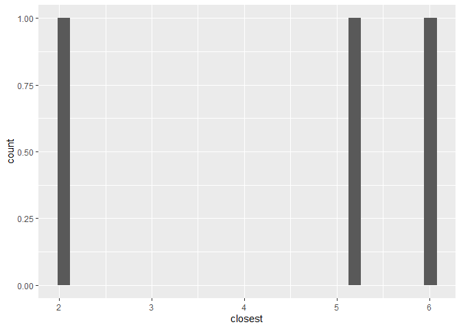

Lab 04 - La Quinta is Spanish for next to Denny’s, Pt. 2
================
Adam Paul
5/6/2022

### Load packages and data

``` r
library(tidyverse) 
```

I couldn’t get the library to work so I removed that code so it would
knit.

``` r
states <- read_csv("data/states.csv")
load("data/dennys.rda")
load("data/laquinta.rda")
```

Since we’re doing visualisations, I’m bringing in some of my portfolio
code to make them look nicer and make the coding easier.

,

``` r
vis_col =   
  scale_fill_manual(values = c( #Color codes for the conditions, switched to colorblind friendly colors
    "address.x" = "#E69F00",
    "closest" = "#56B4E9"))

vis_theme =  theme(panel.background = element_blank(), #makes the background invisible
                   panel.grid.major.y = element_line(color = "#DAE1E7"), #makes the y-axis gridlines appear, but not x-axis
axis.line = element_line(color = "black")) #makes the axis appear in a dark black color

vis_text =     theme( #trbl are the margin signs, top, right, bottom, left
    plot.title = element_text(size = 20, margin = margin(b = 5)),
    plot.subtitle = element_text(size = 12, margin = margin(b= 10)),
    axis.text = element_text(size = 12),
    axis.title = element_text(size = 16, hjust = 1),    
    axis.title.x = element_text(margin = margin(r= 10, t = 10)),
    axis.title.y = element_text(margin = margin(r = 10)),
    axis.text.y = element_text(margin = margin(r = 5)),
    axis.text.x = element_text(margin = margin(t = 5)),
  )
```

### Exercise 1

> Filter the Denny’s dataframe for Alaska (AK) and save the result as
> dn\_ak. How many Denny’s locations are there in Alaska?

``` r
dn_ak <- dennys %>%
  filter(state == "AK")
nrow(dn_ak)
```

    ## [1] 3

There are 3 Denny’s in Alaska.

### Exercise 2

> Filter the La Quinta dataframe for Alaska (AK) and save the result as
> lq\_ak. How many La Quinta locations are there in Alaska?

``` r
lq_ak <- laquinta %>%
  filter(state == "AK")
nrow(lq_ak)
```

    ## [1] 2

There are 2 La Quintas in Alaska.

### Exercise 3

> How many pairings are there between all Denny’s and all La Quinta
> locations in Alaska, i.e., how many distances do we need to calculate
> between the locations of these establishments in Alaska?

There are six distances, because 2x3=6

### Exercise 4

Merging the two subset dataframes.

``` r
dn_lq_ak <- full_join(dn_ak, lq_ak, by = "state")
dn_lq_ak
```

    ## # A tibble: 6 x 11
    ##   address.x     city.x state zip.x longitude.x latitude.x address.y city.y zip.y
    ##   <chr>         <chr>  <chr> <chr>       <dbl>      <dbl> <chr>     <chr>  <chr>
    ## 1 2900 Denali   Ancho~ AK    99503       -150.       61.2 3501 Min~ "\nAn~ 99503
    ## 2 2900 Denali   Ancho~ AK    99503       -150.       61.2 4920 Dal~ "\nFa~ 99709
    ## 3 3850 Debarr ~ Ancho~ AK    99508       -150.       61.2 3501 Min~ "\nAn~ 99503
    ## 4 3850 Debarr ~ Ancho~ AK    99508       -150.       61.2 4920 Dal~ "\nFa~ 99709
    ## 5 1929 Airport~ Fairb~ AK    99701       -148.       64.8 3501 Min~ "\nAn~ 99503
    ## 6 1929 Airport~ Fairb~ AK    99701       -148.       64.8 4920 Dal~ "\nFa~ 99709
    ## # ... with 2 more variables: longitude.y <dbl>, latitude.y <dbl>

> How many observations are in the joined dn\_lq\_ak data frame? What
> are the names of the variables in this data frame.

There are six observations, for each of the six possible matchings of
restaurant to hotel. The variable names are taken from the original data
frame and identified differentially by .x or .y.

address.x, city.x, state, zip.x, longitude.x, latitude.x, address.y,
city.y, zip.y, longitude.y, and latitude.y

### Exercise 5

What function from the tidyverse do we use the add a new variable to a
data frame while keeping the existing variables?

The function I would use is mutate, and mutate into a new variable name.
Format similar to

ds &lt;- ds %&gt;% mutate(new\_Var=case\_when( old\_var \~ whatever is
desired ))

Creating the function needed for calculating distance.

``` r
haversine <- function(long1, lat1, long2, lat2, round = 3) {
  # convert to radians
  long1 = long1 * pi / 180
  lat1  = lat1  * pi / 180
  long2 = long2 * pi / 180
  lat2  = lat2  * pi / 180
  
  R = 6371 # Earth mean radius in km
  
  a = sin((lat2 - lat1)/2)^2 + cos(lat1) * cos(lat2) * sin((long2 - long1)/2)^2
  d = R * 2 * asin(sqrt(a))
  
  return( round(d,round) ) # distance in km
}
```

### Exercise 6

> Calculate the distances between all pairs of Denny’s and La Quinta
> locations and save this variable as distance. Make sure to save this
> variable in THE dn\_lq\_ak data frame so that you can use it later.

``` r
dn_lq_ak <- dn_lq_ak %>%
  mutate(
    distance= haversine(longitude.x, latitude.x, longitude.y, latitude.y)
  )
```

### Exercise 7

> Calculate the minimum distance between a Denny’s and La Quinta for
> each Denny’s location. To do so we group by Denny’s locations and
> calculate a new variable that stores the information for the minimum
> distance.

``` r
dn_lq_ak_mindist <- dn_lq_ak %>%
  group_by(address.x) %>%
  summarize(closest = min(distance))
```

### Exercise 8

> Describe the distribution of the distances Denny’s and the nearest La
> Quinta locations in Alaska. Also include an appripriate visualization
> and relevant summary statistics.

``` r
dn_lq_ak_mindist %>%
summary(closest)
```

    ##   address.x            closest     
    ##  Length:3           Min.   :2.035  
    ##  Class :character   1st Qu.:3.616  
    ##  Mode  :character   Median :5.197  
    ##                     Mean   :4.410  
    ##                     3rd Qu.:5.598  
    ##                     Max.   :5.998

The closest distance between any Denny’s and La Quinta is 2.035km, and
the furthest is 5.998. The average distance is .4.410km, but the median
is 5.197 because two are between 5-6km and one is a little over 2km.

``` r
ggplot(dn_lq_ak_mindist, aes(x= closest)) +
geom_histogram()
```

    ## `stat_bin()` using `bins = 30`. Pick better value with `binwidth`.

<!-- -->

Okay, this is probably not needed, but I want to show that I did it.

``` r
ggplot(dn_lq_ak_mindist, aes(x = address.x, y = closest, fill= address.x)) + 
  geom_bar(stat='identity') +
    guides(fill = FALSE) + # Allows the aes colors to be done manually.
  vis_theme + 
  labs(x= "Address",
       y= "Distance (KM)",
    title= "Dennys and La Quintas in Alaska") +
     scale_fill_manual(values = c(
    "1929 Airport Way" = "#E69F00",
    "2900 Denali" = "#56B4E9",
    "3850 Debarr Road" = "#009E73")) +
  vis_text
```

<!-- -->

### Exercise 9

> Repeat the same analysis for North Carolina: (i) filter Denny’s and La
> Quinta Data Frames for NC, (ii) join these data frames to get a
> complete list of all possible pairings, (iii) calculate the distances
> between all possible pairings of Denny’s and La Quinta in NC, (iv)
> find the minimum distance between each Denny’s and La Quinta location,
> (v) visualize and describe the distribution of these shortest
> distances using appropriate summary statistics.

``` r
dn_NC <- dennys %>% #Making the NC Dennys
  filter(state == "NC")
nrow(dn_NC)
```

    ## [1] 28

``` r
# There are 28 Denny's

lq_NC <- laquinta %>% # MAking the NC laquinta
  filter(state == "NC")
nrow(lq_NC)
```

    ## [1] 12

``` r
# There are 12 Laquinta's

dn_lq_NC <- full_join(dn_NC, lq_NC, by = "state")
dn_lq_NC
```

    ## # A tibble: 336 x 11
    ##    address.x    city.x state zip.x longitude.x latitude.x address.y city.y zip.y
    ##    <chr>        <chr>  <chr> <chr>       <dbl>      <dbl> <chr>     <chr>  <chr>
    ##  1 1 Regent Pa~ Ashev~ NC    28806       -82.6       35.6 165 Hwy ~ "\nBo~ 28607
    ##  2 1 Regent Pa~ Ashev~ NC    28806       -82.6       35.6 3127 Slo~ "\nCh~ 28208
    ##  3 1 Regent Pa~ Ashev~ NC    28806       -82.6       35.6 4900 Sou~ "\nCh~ 28217
    ##  4 1 Regent Pa~ Ashev~ NC    28806       -82.6       35.6 4414 Dur~ "\nDu~ 27707
    ##  5 1 Regent Pa~ Ashev~ NC    28806       -82.6       35.6 1910 Wes~ "\nDu~ 27713
    ##  6 1 Regent Pa~ Ashev~ NC    28806       -82.6       35.6 1201 Lan~ "\nGr~ 27407
    ##  7 1 Regent Pa~ Ashev~ NC    28806       -82.6       35.6 1607 Fai~ "\nCo~ 28613
    ##  8 1 Regent Pa~ Ashev~ NC    28806       -82.6       35.6 191 Cres~ "\nCa~ 27518
    ##  9 1 Regent Pa~ Ashev~ NC    28806       -82.6       35.6 2211 Sum~ "\nRa~ 27612
    ## 10 1 Regent Pa~ Ashev~ NC    28806       -82.6       35.6 1001 Aer~ "\nMo~ 27560
    ## # ... with 326 more rows, and 2 more variables: longitude.y <dbl>,
    ## #   latitude.y <dbl>

``` r
# There are 336 comparisons.

dn_lq_NC <- mutate(dn_lq_NC, distance = haversine(longitude.x,latitude.x, longitude.y, latitude.y, round = 3))

dn_lq_NC_mindist <- dn_lq_NC %>%
  group_by(address.x) %>%
  summarize(closest = min(distance))
```

``` r
dn_lq_NC_mindist %>%
summary(closest)
```

    ##   address.x            closest       
    ##  Length:28          Min.   :  1.779  
    ##  Class :character   1st Qu.: 22.388  
    ##  Mode  :character   Median : 53.456  
    ##                     Mean   : 65.444  
    ##                     3rd Qu.: 93.985  
    ##                     Max.   :187.935

``` r
ggplot(data = dn_lq_NC_mindist, aes(x = closest)) +
  geom_histogram()
```

    ## `stat_bin()` using `bins = 30`. Pick better value with `binwidth`.

<!-- -->

The closest is 1.78 KM away, and the furthest is 187.94 KM away. The
mean is 65.44 KM, and the median is 55.46.

### Exercise 10

> Repeat the same analysis for Texas.

``` r
dn_tx <- dennys %>% 
  filter(state == "TX")
nrow(dn_tx)
```

    ## [1] 200

``` r
# There are 200 Denny's

lq_tx <- laquinta %>% 
  filter(state == "TX")
nrow(lq_tx)
```

    ## [1] 237

``` r
# There are 237 Laquinta's

dn_lq_tx <- full_join(dn_tx, lq_tx, by = "state")
dn_lq_tx
```

    ## # A tibble: 47,400 x 11
    ##    address.x    city.x state zip.x longitude.x latitude.x address.y city.y zip.y
    ##    <chr>        <chr>  <chr> <chr>       <dbl>      <dbl> <chr>     <chr>  <chr>
    ##  1 120 East I-~ Abile~ TX    79601       -99.6       32.4 3018 Cat~ "\nAb~ 79606
    ##  2 120 East I-~ Abile~ TX    79601       -99.6       32.4 3501 Wes~ "\nAb~ 79601
    ##  3 120 East I-~ Abile~ TX    79601       -99.6       32.4 14925 La~ "\nAd~ 75254
    ##  4 120 East I-~ Abile~ TX    79601       -99.6       32.4 909 East~ "\nAl~ 78516
    ##  5 120 East I-~ Abile~ TX    79601       -99.6       32.4 2400 Eas~ "\nAl~ 78332
    ##  6 120 East I-~ Abile~ TX    79601       -99.6       32.4 1220 Nor~ "\nAl~ 75013
    ##  7 120 East I-~ Abile~ TX    79601       -99.6       32.4 1165 Hwy~ "\nAl~ 76009
    ##  8 120 East I-~ Abile~ TX    79601       -99.6       32.4 880 Sout~ "\nAl~ 77511
    ##  9 120 East I-~ Abile~ TX    79601       -99.6       32.4 1708 Int~ "\nAm~ 79103
    ## 10 120 East I-~ Abile~ TX    79601       -99.6       32.4 9305 Eas~ "\nAm~ 79118
    ## # ... with 47,390 more rows, and 2 more variables: longitude.y <dbl>,
    ## #   latitude.y <dbl>

``` r
# There are 47,400 comparisons.

dn_lq_tx <- mutate(dn_lq_tx, distance = haversine(longitude.x,latitude.x, longitude.y, latitude.y, round = 3))

dn_lq_tx_mindist <- dn_lq_tx %>%
  group_by(address.x) %>%
  summarize(closest = min(distance))
```

``` r
dn_lq_tx_mindist %>%
summary(closest)
```

    ##   address.x            closest       
    ##  Length:200         Min.   : 0.0160  
    ##  Class :character   1st Qu.: 0.7305  
    ##  Mode  :character   Median : 3.3715  
    ##                     Mean   : 5.7918  
    ##                     3rd Qu.: 6.6303  
    ##                     Max.   :60.5820

``` r
ggplot(data = dn_lq_tx_mindist, aes(x = closest)) +
  geom_histogram()
```

    ## `stat_bin()` using `bins = 30`. Pick better value with `binwidth`.

<!-- -->

The closest is .02 KM, the furthest 60.58. The mean is 5.79, the median
is 3.37.

### Exercise 11

> Repeat the same analysis for a state of your choosing, different than
> the ones we covered so far.

I choose Tennessee.

``` r
dn_tn <- dennys %>% 
  filter(state == "TN")
nrow(dn_tn)
```

    ## [1] 7

``` r
# There are 7 Denny's

lq_tn <- laquinta %>% 
  filter(state == "TN")
nrow(lq_tn)
```

    ## [1] 30

``` r
# There are 30 Laquinta's

dn_lq_tn <- full_join(dn_tn, lq_tn, by = "state")
dn_lq_tn
```

    ## # A tibble: 210 x 11
    ##    address.x    city.x state zip.x longitude.x latitude.x address.y city.y zip.y
    ##    <chr>        <chr>  <chr> <chr>       <dbl>      <dbl> <chr>     <chr>  <chr>
    ##  1 1011 Paul H~ Cleve~ TN    37312       -84.9       35.2 6650 Rin~ "\nEa~ 37412
    ##  2 1011 Paul H~ Cleve~ TN    37312       -84.9       35.2 7017 Sha~ "\nCh~ 37421
    ##  3 1011 Paul H~ Cleve~ TN    37312       -84.9       35.2 311 Brow~ "\nCh~ 37419
    ##  4 1011 Paul H~ Cleve~ TN    37312       -84.9       35.2 5000 New~ "\nHi~ 37343
    ##  5 1011 Paul H~ Cleve~ TN    37312       -84.9       35.2 7051 McC~ "\nCh~ 37421
    ##  6 1011 Paul H~ Cleve~ TN    37312       -84.9       35.2 251 Holi~ "\nCl~ 37040
    ##  7 1011 Paul H~ Cleve~ TN    37312       -84.9       35.2 130 Inte~ "\nCl~ 37312
    ##  8 1011 Paul H~ Cleve~ TN    37312       -84.9       35.2 1131 Sou~ "\nCo~ 38501
    ##  9 1011 Paul H~ Cleve~ TN    37312       -84.9       35.2 120 Sout~ "\nGo~ 37072
    ## 10 1011 Paul H~ Cleve~ TN    37312       -84.9       35.2 2370 N. ~ "\nJa~ 38305
    ## # ... with 200 more rows, and 2 more variables: longitude.y <dbl>,
    ## #   latitude.y <dbl>

``` r
# There are 210 comparisons.

dn_lq_tn <- mutate(dn_lq_tn, distance = haversine(longitude.x,latitude.x, longitude.y, latitude.y, round = 3))

dn_lq_tn_mindist <- dn_lq_tn %>%
  group_by(address.x) %>%
  summarize(closest = min(distance))
```

``` r
dn_lq_tn_mindist %>%
summary(closest)
```

    ##   address.x            closest       
    ##  Length:7           Min.   : 0.2820  
    ##  Class :character   1st Qu.: 0.5575  
    ##  Mode  :character   Median : 2.9320  
    ##                     Mean   : 9.3970  
    ##                     3rd Qu.:13.8260  
    ##                     Max.   :33.7980

``` r
ggplot(data = dn_lq_tn_mindist, aes(x = closest)) +
  geom_histogram()
```

    ## `stat_bin()` using `bins = 30`. Pick better value with `binwidth`.

<!-- -->

The closest is .28 KM, the furthest 33.80. The mean is 9.40, the median
is 2.93.

### Exercise 12

> Among the states you examined, where is Mitch Hedberg’s joke most
> likely to hold true? Explain your reasoning.

By far, Texas is the most accurate. Not only is the mean the lowest at
5.79KM, but the median is 3.37. Overwhelmingly, Denny’s and Laquintas
are in close proximity to one another.
